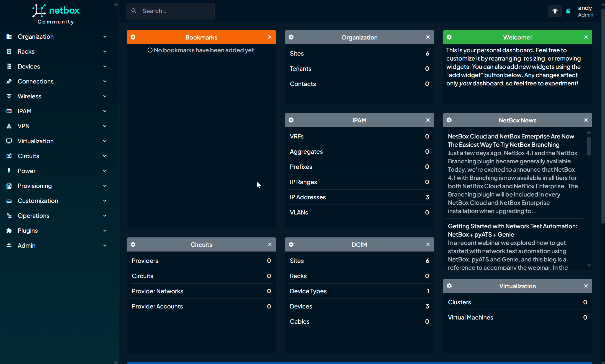
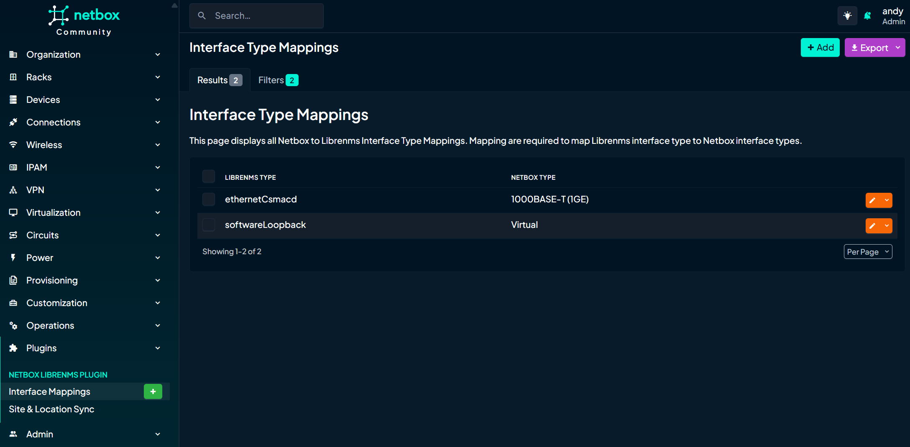

# NetBox LibreNMS Plugin

This plugin provides the ability to sync data between Netbox and LibreNMS.

This is in early development.

## Features

The plugin offers the following key features:

### Interface Synchronization
Pull interface data from LibreNMS into NetBox. The following interface attributes are synchronized:
- Interface Name
- Interface Description
- Interface Status (Enabled/Disabled)
- Interface Type (with custom mapping support)**
- Interface Speed

** Set custom mappings for interface types to ensure that the correct interface type is used when syncing from LibreNMS to NetBox. 

### Site & Location Synchronization
The plugin also supports synchronizing NetBox Sites with LibreNMS locations:
- Compare NetBox sites to LibreNMS location data
- Create LibreNMS locations to match NetBox sites
- Update existing LibreNMS locations langitude and longitude values based on NetBox data
- Sync device site to LibreNMS location


## Screenshots/GIFs
#### Site & Location Sync


#### Sync devices and Interfaces


#### Interface Type Mappings



## Contributing
There's more to do! Coding is not my day job. Bugs will exist and imporvements will be needed. So contributions are very welcome!  I've got more ideas for new features and imporvements but please [contribute](docs/contributing.md) if you can!

Or just share your ideas for the plugin over in [discussions](https://github.com/bonzo81/netbox-librenms-plugin/discussions ).

## Compatibility

| NetBox Version | Plugin Version |
|----------------|----------------|
|     4.0        |      0.2.x     |

## Installing

Netbox 4.0+ is required.

### Standard Installation

Activate your virtual environment and install the plugin:

```bash
source /opt/netbox/venv/bin/activate
```
Install with pip:

```bash
(venv) $ pip install netbox-librenms-plugin
```

Add to your `local_requirements.txt` to ensure it is automatically reinstalled during future upgrades.

```bash
 "netbox-librenms-plugin" >> /opt/netbox/netbox/local_requirements.txt
```

### Docker

For adding to a NetBox Docker setup see how to create a custom Docker image.
[the general instructions for using netbox-docker with plugins](https://github.com/netbox-community/netbox-docker/wiki/Using-Netbox-Plugins).

Add the plugin to `plugin_requirements.txt` (netbox-docker):

```bash
# plugin_requirements.txt
netbox-librenms-plugin
```

## Configuration

Enable the plugin in `/opt/netbox/netbox/netbox/configuration.py`,
 or if you use netbox-docker, your `/configuration/plugins.py` file :

```python
PLUGINS = [
    'netbox-librenms-plugin'
]

PLUGINS_CONFIG = {
    'netbox_librenms_plugin': {
        'librenms_url': 'https://your-librenms-instance.com',
        'api_token': 'your_librenms_api_token',
        'cache_timeout': 300,
    }
}
```

### Apply Database Migrations

Apply database migrations with Netbox `manage.py`:

```
(venv) $ python manage.py migrate
```

### Restart Netbox

Restart the Netbox service to apply changes:

```
sudo systemctl restart netbox
```

## Uninstall

See [the instructions for uninstalling plugins](https://netboxlabs.com/docs/netbox/en/stable/plugins/removal/).

## Credits

Based on the NetBox plugin tutorial and docs:

- [demo repository](https://github.com/netbox-community/netbox-plugin-demo)
- [tutorial](https://github.com/netbox-community/netbox-plugin-tutorial)
- [docs](https://netboxlabs.com/docs/netbox/en/stable/plugins/development/)

This package was created with [Cookiecutter](https://github.com/audreyr/cookiecutter). Thanks to the [`netbox-community/cookiecutter-netbox-plugin`](https://github.com/netbox-community/cookiecutter-netbox-plugin) for the project template. 
