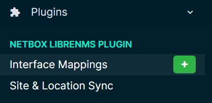
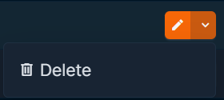

# interface\_mappings

### Quick Intro

Interface type mappings control how LibreNMS interface types are translated to NetBox interface types during synchronization.

The mappings can be customized in the plugin settings menu.

A mapping of LibreNMS Type an LibreNMS Speed combine to make a unique group that map to a Netbox interface type. This means multiple mapping for the same LibreNMS Type can be created.

> Note: The LibreNMS Speed is entered as Kbps

Example:

```
* ethernetCsmacd + 10000000 = 10GBASE-T (10GE)
* ethernetCsmacd + 1000000 = 1000BASE-T (1GE)
* ethernetCsmacd + 100000 = 100BASE-TX (10/100ME)
```

### How to Use Interface Mappings

#### Accessing the Page:

{ width="250" }

* From the main menu, navigate to the Plugins section
* Under Netbox Librenms Plugin, Select "Interface Mappings"

#### Creating a New Mapping:

{ width="50" }

* Click the green `+` or `Add` button either from the menu or on the Interface Mappings page
* Enter LibreNMS interface type. _You can copy this from plugin's device interface sync page_
* Enter Librenms interface speed as Kbps
* Select the Netbox interface type from the dropdown
* Click `Create` to save the mapping

#### Bulk Importing Mappings:

The plugin supports NetBox's standard bulk import feature for interface mappings. Click the **Import** button on the Interface Mappings page to access the import interface.

**YAML Example:**

```yaml
---
- librenms_type: ethernetCsmacd
  librenms_speed: 10000000
  netbox_type: 10gbase-t

- librenms_type: ethernetCsmacd
  librenms_speed: 1000000
  netbox_type: 1000base-t

- librenms_type: ethernetCsmacd
  librenms_speed: 100000
  netbox_type: 100base-tx

- librenms_type: ethernetCsmacd
  librenms_speed: null
  netbox_type: other

- librenms_type: propVirtual
  librenms_speed: null
  netbox_type: virtual

- librenms_type: softwareLoopback
  librenms_speed: null
  netbox_type: virtual

- librenms_type: l2vlan
  librenms_speed: null
  netbox_type: lag

- librenms_type: ieee8023adLag
  librenms_speed: null
  netbox_type: lag

- librenms_type: tunnel
  librenms_speed: null
  netbox_type: virtual
```

**Notes:**

* `librenms_speed` is optional - use `null` or omit for type-only mappings
* The combination of `librenms_type` and `librenms_speed` must be unique
* Supports CSV, JSON, and YAML formats

#### Editing Existing Mappings:

{ width="50" }

* On the Mappings page, Locate the desired mapping in the list
* Click the `edit` (pencil icon) button
* Modify the field mappings as needed
* Save the changes

#### Deleting Mappings:

{ width="150" }

* Find the mapping you wish to remove
* Select the `Delete` button from the drop down
* Confirm the deletion when prompted

#### Applying Mappings:

* Mappings are automatically applied when interface data is synced between LibreNMS and Netbox
* If a mapping exist for an interface, it will show on the interface sync page with the icon :material-link-variant:
* If a mapping does not exist, it will show the icon :material-link-variant-off:

### Best Practices

* Check mappings are correct before performing a sync to avoid data errors
* Regularly review and update your mappings to ensure they remain accurate
