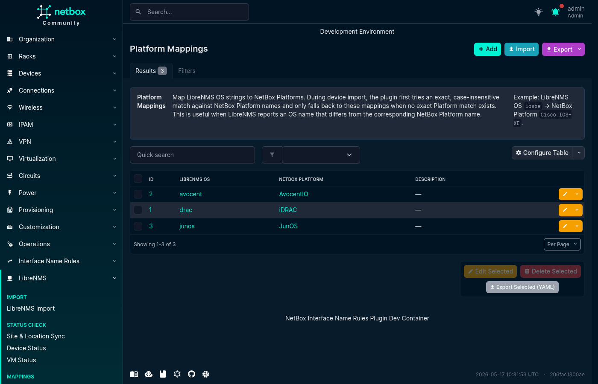
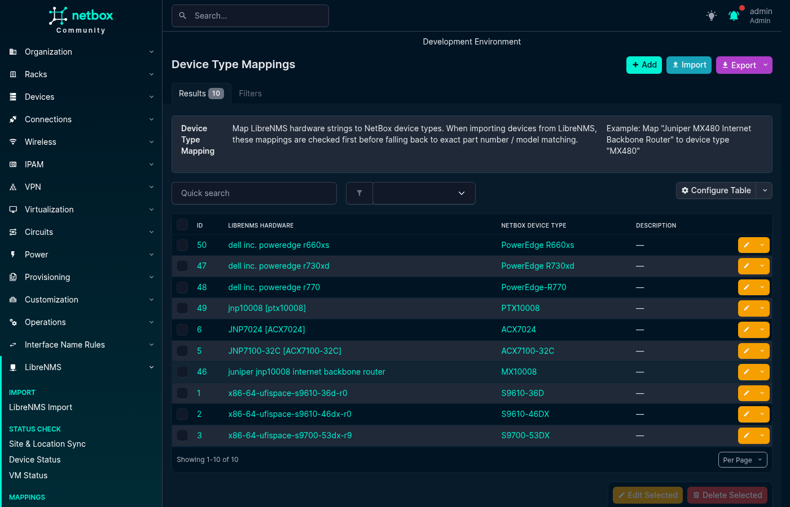
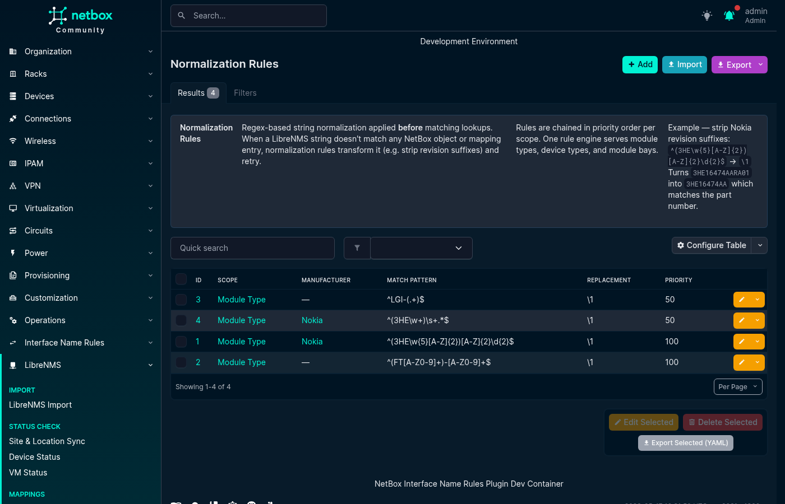
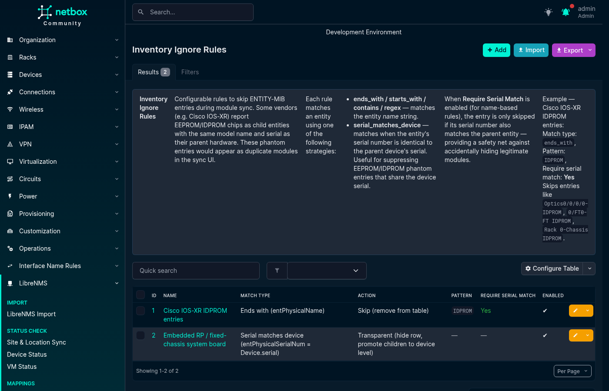
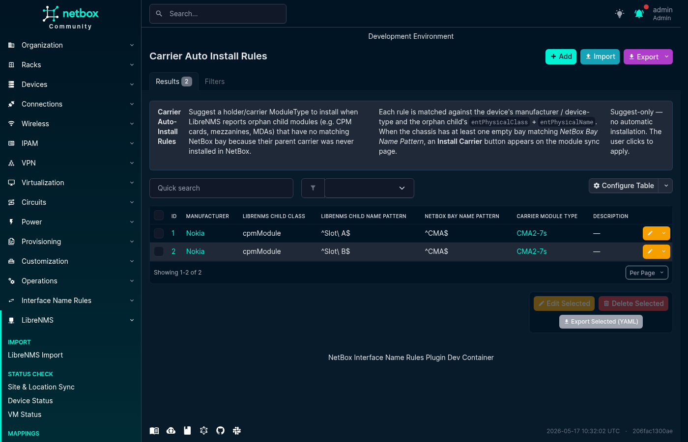

# Mapping Rules

Mapping rules are the configuration layer that connects LibreNMS identifiers to NetBox objects. Without them the plugin relies on exact-string matching; with them you can cover vendor naming variations, OS string aliases, model-number differences, and bay naming schemes across your entire fleet.

All mapping types live under **Plugins > LibreNMS > Mappings** in the NetBox menu and support individual creation, editing, deletion, and bulk YAML import/export.

---

## Platform Mappings

Maps a LibreNMS OS string (e.g. `junos`, `eos`, `ios`) to a NetBox Platform object.

**Used by:**
- Device Field Sync — platform sync on the device LibreNMS-Sync page
- Device Import — platform auto-match when importing devices from LibreNMS

Matching is case-insensitive. The plugin first tries an exact `Platform.name` match against existing NetBox Platforms; if none (or ambiguous), it falls back to `PlatformMapping`. If neither produces a unique result, the field is left empty.

**YAML format:**

```yaml
- librenms_os: junos
  netbox_platform: JunOS
  description: "Juniper JunOS"
```

**Screenshot:**



---

## Device Type Mappings

Maps a LibreNMS hardware string (e.g. `Juniper MX480 Internet Backbone Router`) to a NetBox DeviceType object.

**Used by:**
- Device Import — device type auto-match when importing

Matching is case-insensitive and exact: the LibreNMS hardware string must equal the DeviceTypeMapping's `librenms_hardware` value (or, if no mapping matches, the DeviceType's `part_number` or `model`). The plugin does not perform partial or containment matching.

**YAML format:**

```yaml
- librenms_hardware: "Juniper MX480 Internet Backbone Router"
  netbox_device_type: MX480
  description: "Juniper MX480"
```

**Screenshot:**



---

## Module Type Mappings

Maps a LibreNMS `entPhysicalModelName` string (e.g. `SFP-1G-T`, `3HE16474AA`) to a NetBox ModuleType object.

**Used by:**
- Module Sync — determines which NetBox ModuleType to install or match

Optionally scoped to a **Manufacturer**: when both a manufacturer-scoped and a global mapping exist for the same model string, the manufacturer-scoped row wins for devices from that vendor.

**YAML format:**

```yaml
- librenms_model: SFP-1G-T
  manufacturer: ""
  netbox_module_type: SFP-1G-T
  description: "1G copper SFP"

- librenms_model: 3HE16474AA
  manufacturer: Nokia
  netbox_module_type: "3HE16474AA"
  description: "Nokia CPM"
```

**Screenshot:**


---

## Module Bay Mappings

Maps a LibreNMS `entPhysicalName` string (e.g. `Power Supply 1`) to a NetBox module bay name (e.g. `PSU1`).

**Used by:**
- Module Sync — resolves which NetBox module bay a LibreNMS inventory row corresponds to

Supports:
- **Exact match** — simple string substitution
- **Regex match** — `librenms_name` is a Python regex; `netbox_bay_name` can use backreferences (`\1`, `\2`, …)
- **Class filter** — optional `librenms_class` field (e.g. `powerSupply`, `fan`) to restrict the mapping to items of that ENTITY-MIB class
- **Manufacturer scoping** — vendor-scoped mapping wins over a global one when both match

**YAML format:**

```yaml
- librenms_name: "Power Supply 1"
  librenms_class: powerSupply
  netbox_bay_name: PSU1
  is_regex: false
  manufacturer: ""
  description: ""

- librenms_name: "^FPC(\\d+)$"
  librenms_class: module
  netbox_bay_name: "FPC\\1"
  is_regex: true
  manufacturer: Juniper
  description: "FPC slot regex"
```

**Screenshot:**


---

## Normalization Rules

Regex-based string transformations applied *before* ModuleTypeMapping or ModuleBayMapping lookups. Rules are chained in priority order (lower number = runs first); each rule transforms the output of the previous.

**Scopes:**
- `module_type` — normalizes `entPhysicalModelName` before ModuleTypeMapping lookup
- `device_type` — normalizes LibreNMS hardware string before DeviceTypeMapping lookup
- `module_bay` — normalizes `entPhysicalName` before ModuleBayMapping lookup

Useful for stripping vendor revision suffixes so a single ModuleTypeMapping entry covers all hardware revisions.

**Example:** strip Nokia revision suffixes

```text
scope:         module_type
manufacturer:  Nokia
match_pattern: ^(3HE\w{5}[A-Z]{2})[A-Z]{2}\d{2}$
replacement:   \1
Result: 3HE16474AARA01 -> 3HE16474AA
```

**YAML format:**

```yaml
- scope: module_type
  manufacturer: Nokia
  match_pattern: "^(3HE\\w{5}[A-Z]{2})[A-Z]{2}\\d{2}$"
  replacement: "\\1"
  priority: 10
  description: "Strip Nokia revision suffix"
```

**Screenshot:**



---

## Inventory Ignore Rules

Filter or reclassify specific ENTITY-MIB inventory items that would otherwise appear as spurious rows in the Module Sync table.

**Actions:**
- **Skip** — removes the matched item from the sync table entirely. Use for phantom EEPROM/IDPROM child entities that some vendors (Cisco IOS-XR) report with the same model and serial as the parent.
- **Transparent** — hides the row but *promotes* its children to device-level bay matching. Use for fixed-chassis devices (e.g. Cisco 8201-SYS) where the system board entity is the device itself and its children (transceivers, fans, PSUs) should be matched directly against device-level bays.

**Match types:**
- `ends_with` / `starts_with` / `contains` — compare `entPhysicalName` (case-insensitive)
- `regex` — Python regex against `entPhysicalName`
- `serial_matches_device` — matches when `entPhysicalSerialNum` equals the NetBox device's own serial (no pattern required)

The **Require serial match parent** option (recommended) adds a safety net: the name-based rule only fires when the item's serial number also matches an ancestor entity's serial.

**YAML format:**

```yaml
- name: "Cisco IOS-XR IDPROM phantom"
  match_type: ends_with
  pattern: "IDPROM"
  action: skip
  require_serial_match_parent: true
  enabled: true
  description: "Remove IDPROM phantoms from Cisco IOS-XR inventory"
```

**Screenshot:**



---

## Carrier Auto-Install Rules

Some chassis report child components (CPMs, MDAs, mezzanines) without the intermediate carrier/holder module that must first exist in NetBox for those children to have a bay to live in. A Carrier Auto-Install Rule tells the plugin: "for this manufacturer / device type, when you see an orphan component of this class and name pattern, suggest installing this ModuleType into the matching empty bay."

Rules are **suggest-only** — no module is installed automatically. The user clicks an **Install Carrier** button that appears in the Module Sync table when a rule fires.

**Fields:**
- `manufacturer` — optional; scope to one vendor
- `device_type_pattern` — optional regex (fullmatch) on DeviceType model name
- `librenms_child_class` — exact `entPhysicalClass` of the orphan (e.g. `cpmModule`)
- `librenms_child_name_pattern` — regex (fullmatch) on the orphan's `entPhysicalName`
- `netbox_bay_name_pattern` — regex (fullmatch) on empty chassis-level bay name(s) to offer as install targets
- `carrier_module_type` — the ModuleType to suggest installing

**YAML format:**

```yaml
- manufacturer: Nokia
  device_type_pattern: ".*SR-s.*"
  librenms_child_class: cpmModule
  librenms_child_name_pattern: "^Slot [AB]$"
  netbox_bay_name_pattern: "^CMA$"
  carrier_module_type: "Nokia CMA Carrier"
  description: "Nokia 7750 SR-s CMA carrier suggestion"
```

**Screenshot:**



---

## Bulk Import / Export

All mapping types support NetBox's standard bulk YAML import. Click the **Import** button next to any mapping list. You can also export existing mappings as YAML for backup or cross-environment migration using the **Export** action on the list page.

Pre-built example rules for common vendor patterns are available in [`contrib/`](../../contrib/) in the plugin repository. Pull requests with additional examples or corrections are welcome.
