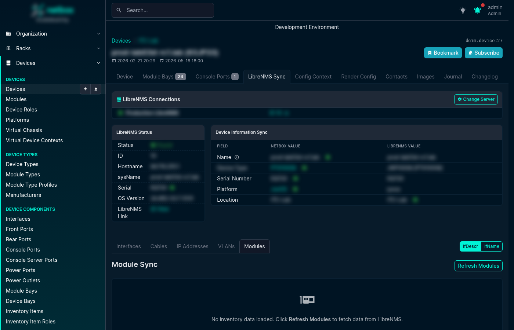

# Module Sync

The Module Sync tab lets you reconcile LibreNMS physical inventory (ENTITY-MIB, plus a transceiver API source for vendors that don't expose SFPs via ENTITY-MIB) with the installed modules recorded in NetBox. It appears as a **Modules** tab on the LibreNMS Sync page for every Device and Virtual Chassis.

## How It Works

When you open the Modules tab, the plugin fetches the ENTITY-MIB inventory tree from LibreNMS, merges in transceiver data from the LibreNMS transceiver API (used for vendors that don't expose SFPs via ENTITY-MIB), and compares each line-card, transceiver, fan, power supply, and other physical component against the NetBox module bays and installed modules for that device.

Each row in the table shows:

- **LibreNMS Name** — the `entPhysicalName` value reported by the device
- **LibreNMS Model** — the `entPhysicalModelName` value (used for type matching)
- **Serial** — `entPhysicalSerialNum`
- **Status** — the result of matching (see below)
- **NetBox Bay** — the module bay the component was matched to
- **NetBox Module** — the installed module in that bay (if any)
- **Actions** — buttons to install, update, or map the component

## Match Statuses

| Status | Meaning |
|--------|---------|
| **Matched** | LibreNMS component matches an installed NetBox module (same bay, same or mapped type) |
| **No Bay** | A bay mapping was found but no matching module bay exists on this device |
| **No Type** | The bay was found but no ModuleTypeMapping exists for the LibreNMS model |
| **Name Conflict** | The resolved bay name conflicts with an existing module in another bay |
| **Not Installed** | A matching bay exists but no module is installed yet |

## Taking Action

- **Install** — installs a new module into the matched bay using the mapped ModuleType
- **Update** — updates the serial number or module type of an existing installed module
- **Add Mapping** — opens the ModuleBayMapping or ModuleTypeMapping creation modal directly from the row, so you can resolve "No Bay" or "No Type" statuses without leaving the page
- **Add Bay Template** — if the device type is missing a module bay template, this button creates it inline

## Carrier Modules

Some chassis (e.g. Nokia 7750 SR-s) report child components (CPMs, MDAs) without the intermediate carrier/holder module that must first be installed in NetBox before the children become visible. When a CarrierAutoInstallRule matches, a **Suggest Carrier** button appears — clicking it installs the carrier module into the appropriate empty bay, after which the children can be synced normally.

## Virtual Chassis Support

For Virtual Chassis devices, the Modules tab automatically distributes inventory rows across the correct VC member based on the component's position in the ENTITY-MIB tree. Each row shows the member hostname to make it clear which physical switch a component belongs to.

## Screenshot

## Related Configuration

Before using Module Sync you will typically need to configure one or more of the following mapping types (see [Mapping Rules](mapping_rules.md)):

- **ModuleTypeMapping** — maps LibreNMS model strings (e.g. `SFP-1G-T`) to NetBox ModuleType objects
- **ModuleBayMapping** — maps LibreNMS bay names (e.g. `Power Supply 1`) to NetBox bay names (e.g. `PSU1`), with optional regex and manufacturer scoping
- **NormalizationRule** — strips vendor suffixes from model strings before matching (e.g. `3HE16474AARA01` → `3HE16474AA`)
- **InventoryIgnoreRule** — skips or makes transparent phantom EEPROM/IDPROM entities that some vendors (Cisco IOS-XR) report
- **CarrierAutoInstallRule** — suggests installing carrier modules for vendors that omit them from SNMP reporting
