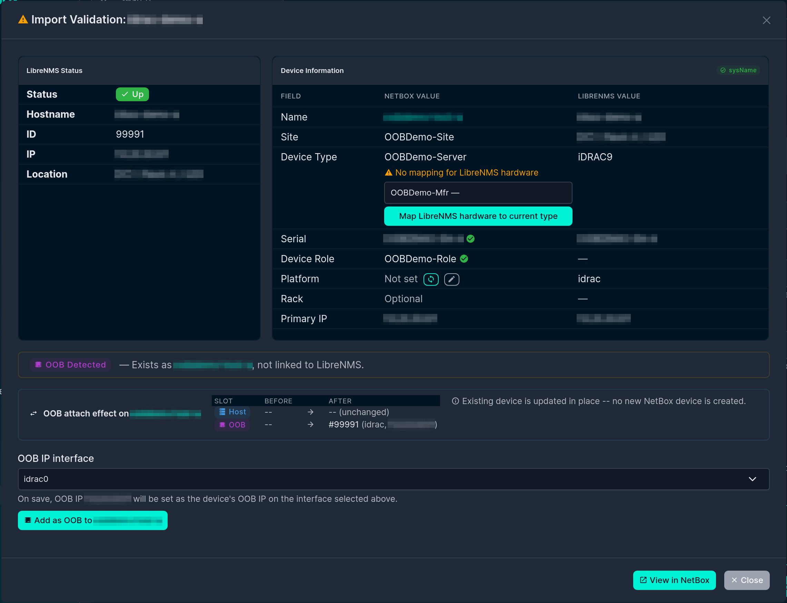
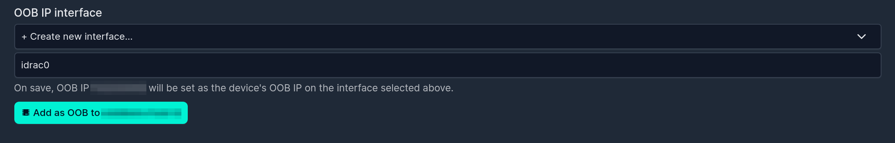

# Out-of-Band (OOB) Management

Many servers expose a dedicated **out-of-band management controller** — iDRAC, iLO, BMC, IPMI, CIMC, and similar. LibreNMS usually polls that controller as its **own device**, separate from the host it lives in. NetBox models the same relationship differently: the controller is not a separate Device — its address is the host Device's **OOB IP** (`oob_ip`).

This plugin bridges the two models. During import it detects when an incoming LibreNMS device is really the OOB side of a host you already have, and offers the right action to reconcile them instead of creating a duplicate device.

## How the link is stored

OOB linkage is recorded in the `librenms_id` [custom field](custom_field.md) alongside the host's own LibreNMS ID. The per-server value is promoted from a bare integer to a small object:

```json
{
  "production": {
    "id": 42,
    "oob": { "id": 99, "type": "drac" }
  }
}
```

- `id` — the LibreNMS device ID of the **host**.
- `oob.id` — the LibreNMS device ID of the **OOB controller**.
- `oob.type` — a short label for the controller (`idrac`, `drac`, `ilo`, `bmc`, `ipmi`, `cimc`, …), or the generic `oob` when the specific type can't be determined.

Only these identity essentials are stored. The controller's IP and firmware version are intentionally **not** persisted here — the IP's source of truth is the host Device's interface-assigned `oob_ip`, and the version lives in LibreNMS and can be read back any time from `oob.id`.

## OOB detection during import

When a searched LibreNMS device looks like an OOB controller (by its OS/hardware strings, e.g. an iDRAC) and matches an existing NetBox device, the validation details show an **OOB Detected** panel instead of a plain import button. From there one of three resolution flows is offered, depending on what already exists.



!!! tip "Not seeing the panel?"
    The panel only appears when **both** conditions hold: the incoming LibreNMS device's `os`/`hardware` (or hostname) matches an OOB pattern (`idrac`, `ilo`, `ipmi`, `bmc`, `drac`, `cimc`), **and** it matches an existing NetBox device by unique **serial** or by **management IP**. If the incoming hostname already matches a NetBox device name it takes the plain hostname-match path instead, and if the device is already linked to LibreNMS no OOB action is offered. (Device identifiers are blurred in these screenshots.)

### Add as OOB

Use when the existing NetBox device is the **host** and the incoming LibreNMS device is its OOB controller.

The **Add as OOB to *device*** action links the controller's LibreNMS ID into the host's `oob.id` slot. NetBox requires `oob_ip` to be assigned to one of the device's interfaces, so the form includes an **OOB IP interface** picker:

- A sensible interface is **pre-selected** (matched by name — `idrac`/`ilo`/`bmc`-style). Because the OOB IP is frequently *not* physically on that interface, the selection is **overridable**.
- Choose **+ Create new interface…** to create one (default name suggested) to hang the OOB IP on.



The OOB IP is then created (or re-homed) assigned to the chosen interface and set as the device's `oob_ip`. If you make no interface selection, the link is still recorded and the OOB IP is left for you to set later.

!!! note "Permissions"
    Setting the OOB IP can create an Interface, create an IPAddress, or re-home an existing one. The action requires the matching NetBox `add`/`change` permissions for those models; if you lack them the link is still recorded and the IP step is skipped with a warning. See [Permissions & Access](permissions.md).

### Promote to host

Use when the existing NetBox device is currently linked to the **OOB controller** (its `librenms_id` points at the controller) and the incoming LibreNMS device is the **host** side.

**Promote to host of *device*** re-points the linkage: the incoming host's LibreNMS ID becomes the device's `id`, and the previously-linked controller ID is demoted into the `oob` slot. No new device is created. A pre-promote modal lets you optionally override the device's **name**, **device type**, and **platform** — all default to **Keep current**, so the original promote behaviour is unchanged unless you explicitly choose **Use new**.

### Merge NetBox devices

Use when **two different NetBox devices** turn out to represent one physical box — typically one created from the LibreNMS hostname and another from the chassis serial, where at least one already carries a LibreNMS link.

The validation modal lists both candidates (hostname-matched and serial-matched) with their current linkage, and you pick which one to **keep** (the *winner*) and which to absorb (the *donor*). Merging consolidates the donor's LibreNMS link state under the active server key into the winner, clears the donor's active link, and writes a `_migrated_to` marker on the donor pointing at the winner. Interfaces, cables, and primary/OOB IPs are **not** moved automatically — you re-home those incrementally (see below).

## Migrating a donor device after a merge

A donor device (one with a `_migrated_to` marker) shows a banner on its LibreNMS sync page with **Move to winner** actions, so you can move resources over at your own pace:

- **Move interface to winner** — reassigns an interface (and the cables, IPs, and MACs that hang off it) to the winner. Fails if the winner already has an interface with the same name — rename or remove that one first.
- **Move IP address to winner** — re-homes an interface-assigned IP to the winner's same-named interface (move the interface first if it doesn't exist on the winner yet).
- **Transfer primary IPv4 / IPv6 / OOB IP** — points the winner's `primary_ip4` / `primary_ip6` / `oob_ip` foreign key at the donor's value and clears it on the donor. Refuses to overwrite a value already set on the winner — clear it there first.

Each action runs under a row lock and verifies the `_migrated_to` marker before touching anything. Once the donor has nothing left to migrate you can delete it.

## Setting Primary and OOB IPs in general

Outside the OOB import flows, both `primary_ip` and `oob_ip` are driven from interface-assigned addresses:

- **Primary IP** is set on the device's **IP Addresses** sync tab: with **Set Primary IP** enabled, a synced IP that matches the LibreNMS management IP and is interface-assigned becomes the device's primary.
- **OOB IP** is set through the **Add as OOB** flow above.

This keeps every IP relationship valid against NetBox's requirement that primary/OOB IPs be assigned to one of the device's own interfaces.

## See also

- [Custom Field Setup](custom_field.md) — the `librenms_id` field that stores the linkage.
- [Validation & Configuration](../librenms_import/validation.md) — where OOB is detected during import.
- [Permissions & Access](permissions.md) — permissions required for the OOB/IP actions.
